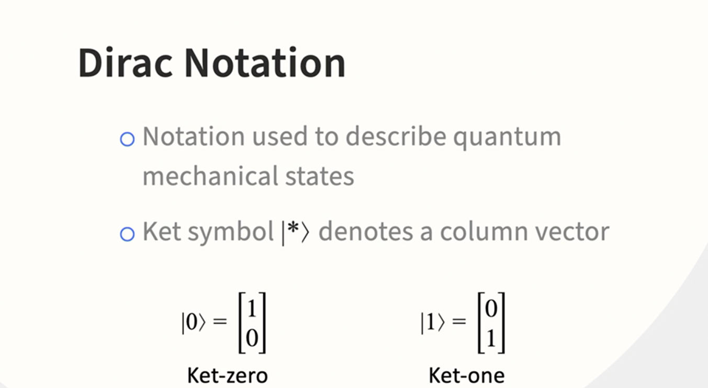
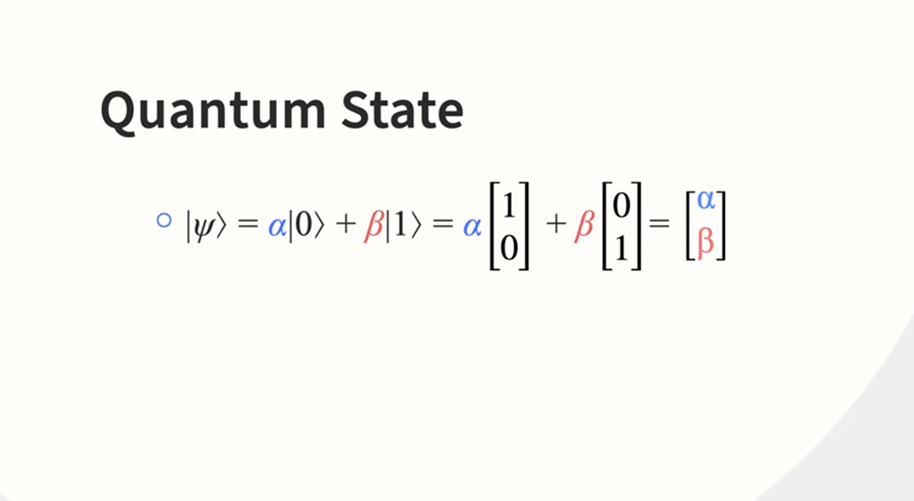
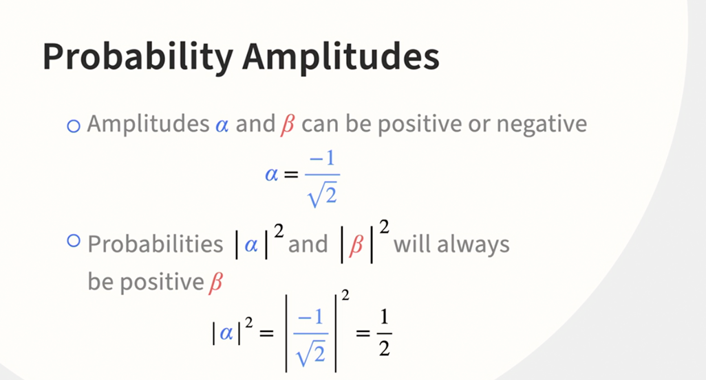
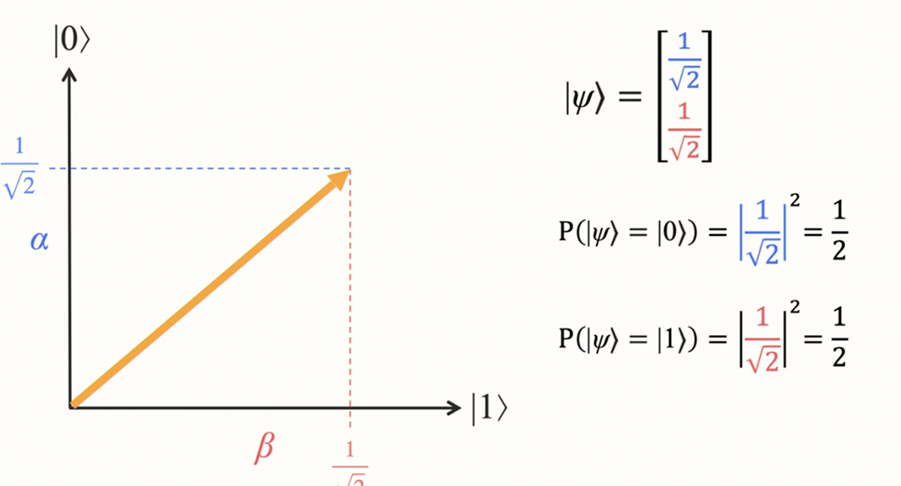
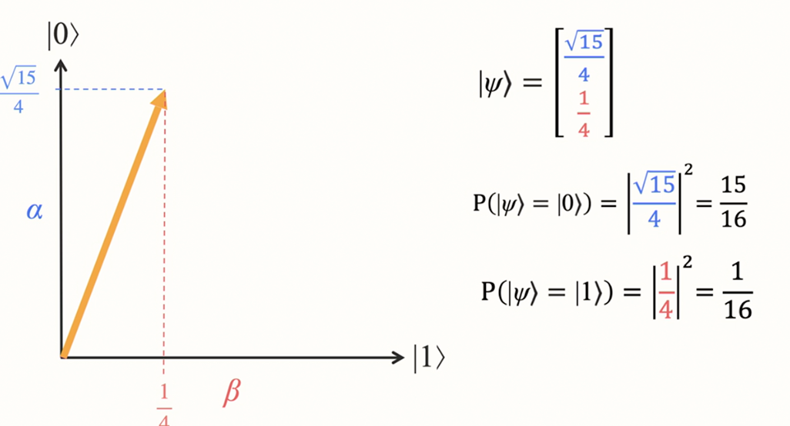
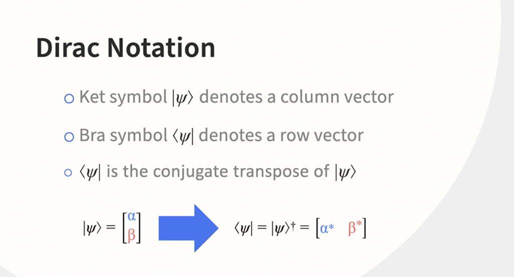
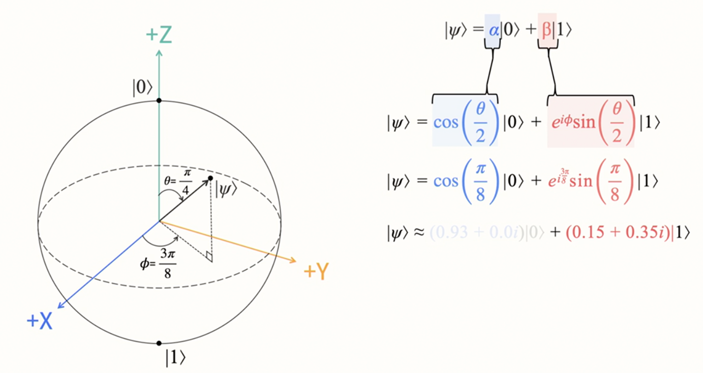

# Quantum Computing Fundamentals

**How Quantum Computers Work**

Quantum computers use individual particles like photons or electrons to store and
process information down at the subatomic level. The subatomic particles behave in interesting ways because they follow
the rules of quantum mechanics, which are different from the classical laws of physics we experience in our normal-sized
world. These properties enable a quantum computer to approach computational problems differently than how a classical
computer would. It encodes problems into quantum bits which use quantum property of _superposition_ to simultaneously
represent multiple outcomes.

It is worth noting that quantum computers have an advantage over classical computers not because they execute operations
faster but since they store and process information differently.

**Quantum Bits (Qubits)**

- While classical computers have two distinct states (0, 1), quantum bits can additionally exist in a superposition
  state. In this state, multiple states can exist together. Qubits are stored using tiny particles that act as quantum
  mechanical systems. For example, electrons have two states (spin up and spin down) while photons have two states (
  horizontal polarization and vertical polarization). These two display the characteristics of quantum mechanics.

**Measuring Qubits**

```jupyter
qr = QuantumRegister(1) # This register stores 1 cubit
cr = ClassicalRegister(1)
circuit = QuantumCircuit(qr, cr)
circuit.measure(qr, cr)
```

- Simulating this will result into a probability of 1 (100%) for 0 and 0 for 1. This indicates that the circuit measured 
a zero every single time. This happens because when a quibit is initialized no quantum operations have been applied to it to put it into a superpostion state





- **alpha** and **beta** are called **probability amplitudes** and indicate how likely we are to get each of the two possible outcomes when measuring a qubit. The absolute value of alpha squared represents the probability that the measurement outcome will be in the zero state, and the absolute value of beta squared is the probability that the outcome will be in the one state.








**Bloch Sphere**

